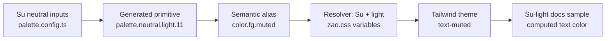

# Phase 1 study · Track A: What a design system is

_Research findings for A1–A5 · 30 September 2026_

This is an agent-produced reference for **Track A** of the [study plan](./STUDY.md), grounded in the linked reading, the current ZAO repo, and a local docs-site inspection. The example definition, principle interpretations, component-page template, and release policy are research syntheses for Yankun to evaluate; they are not his personal study notes or decisions. The paid chapters of Alla Kholmatova's book were not available for review.

## A1 · Definitions and parts

Nielsen Norman Group describes a design system as standards for managing design at scale, with reusable components and patterns. It distinguishes a style guide's visual, content, and interaction rules from a component library's reusable elements, states, attributes, and code. [Source: NN/g, Design Systems 101](https://www.nngroup.com/articles/design-systems-101/). Synthesizing that with Brad Frost's [atomic-design chapters 1](https://atomicdesign.bradfrost.com/chapter-1/) and [2](https://atomicdesign.bradfrost.com/chapter-2/): a design system connects the parts to principles, usage guidance, realistic pages, and ongoing stewardship. Frost's atoms, molecules, organisms, templates, and pages provide a composition model, not a required directory structure.

| Artifact          | Main question it answers                                                       | What it leaves open by itself                                              |
| ----------------- | ------------------------------------------------------------------------------ | -------------------------------------------------------------------------- |
| Style guide       | What should this interface look, sound, and behave like?                       | How to reuse a working implementation.                                     |
| Component library | Which ready-made parts and APIs can I use?                                     | When to choose each part, how to combine them, and how the system evolves. |
| Design system     | Which shared rules, parts, patterns, and practices produce a coherent product? | Product-specific decisions that need local judgment.                       |

**Working three-sentence synthesis:** A design system is the shared set of decisions that lets a team build coherent interfaces repeatedly. It connects principles and usage guidance to tokens, components, patterns, and working code. It stays a system only when people maintain it, test it in real products, and change it deliberately. This is a starting point for Yankun's own A1 definition.

### ZAO inventory, checked against the repo

| Present now                                                                                                                                                                                                                                                                                                | Planned or not yet found                                                                                                                                                                       |
| ---------------------------------------------------------------------------------------------------------------------------------------------------------------------------------------------------------------------------------------------------------------------------------------------------------- | ---------------------------------------------------------------------------------------------------------------------------------------------------------------------------------------------- |
| DTCG sources split among [`base/`](../packages/tokens/src/base/), [`themes/`](../packages/tokens/src/themes/), and [`modes/`](../packages/tokens/src/modes/); a [resolver](../packages/tokens/src/zao.resolver.json); generated palettes from [`palette.config.ts`](../packages/tokens/palette.config.ts). | Shipped Button, Select, or other React components. [`packages/react/src/index.ts`](../packages/react/src/index.ts) currently exports a finish helper and theme/mode types, not component APIs. |
| Su light, Su dark, and Yu dark contexts in [`contexts.ts`](../packages/tokens/contexts.ts); the locked [Tailwind theme](../packages/react/src/styles/theme.css) and self-hosted fonts.                                                                                                                     | Component usage pages, anatomy/variant guidance, and contribution rules beyond the current repo guidance.                                                                                      |
| [Docs shell](../apps/docs/app/page.tsx) and color, space, and typography pages; [token tests](../packages/tokens/test/tokens.test.ts), [CI](../.github/workflows/ci.yml), and [`AGENTS.md`](../AGENTS.md).                                                                                                 | The [agent layer](../packages/agent/README.md), component manifests, MCP server, validator, and [eval runs](../evals/README.md).                                                               |

The [`BRIEF.md`](../BRIEF.md) deliberately delays components until the study and style search. Yu's proposed color direction is not an implemented palette: the current neutral and accent inputs are achromatic.

## A2 · Design language: functional and perceptual patterns

Kholmatova's public [book description](https://www.smashingmagazine.com/design-systems-book/) distinguishes functional patterns, including buttons and text fields, from perceptual patterns, including iconography, color, and typography. The full paid chapters were not reviewed. Nathan Curtis argues that principles and guidance should help teams make actual decisions, that system scope should favor broadly reusable parts, and that adoption and quality require attention after publication. Source: [Principles of Designing Systems](https://medium.com/eightshapes-llc/principles-of-designing-systems-294ee45dcf81).

In ZAO, planned component anatomy, behavior, states, keyboard support, and composition are mostly functional patterns. Palette, radius, overlay material, display face, and motion contribute strongly to perceptual patterns. The split is **not identical** to ZAO's architecture: shared spacing and type sizes also shape perception, and a finish can change how clearly a control reads. [`base/`](../packages/tokens/src/base/) owns shared size and layout, [`themes/`](../packages/tokens/src/themes/) owns the chosen finish, and [`modes/`](../packages/tokens/src/modes/) maps semantic color jobs to palette steps. A cross-finish component should preserve its anatomy and behavior while the finish changes its expression.

### Agent example: five perceptual patterns in Linear

This is an example teardown chosen because [`BRIEF.md`](../BRIEF.md) describes Su as Linear-like; it does not assert Yankun's personal taste or that every current Linear screen has these traits. Linear's [2026 design refresh](https://linear.app/now/behind-the-latest-design-refresh) and its earlier [UI redesign account](https://linear.app/now/how-we-redesigned-the-linear-ui) provide the evidence.

| Perceived quality    | Observable mechanism reported by Linear                                                                                                                                        |
| -------------------- | ------------------------------------------------------------------------------------------------------------------------------------------------------------------------------ |
| Focused              | Quieter navigation makes the task content more prominent.                                                                                                                      |
| Calm                 | Softer, fewer dividers separate areas without outlining every item.                                                                                                            |
| Crisp but warm       | Less saturated, warmer neutrals and deliberate contrast tuning.                                                                                                                |
| Compact and precise  | Smaller tabs and icons, restrained icon color, and careful alignment.                                                                                                          |
| Expressive hierarchy | Display typography carries the top of the hierarchy while body typography stays practical; this point comes from the earlier redesign, not a claim about every current screen. |

### Candidate ZAO principles, compared with the brief

These five sentences translate the research into possible working principles. They sharpen the existing [`BRIEF.md`](../BRIEF.md) principles without changing the project's decisions. Yankun can keep, reject, or reword them after his own A2 exercise.

| Candidate wording                                                                     | Relationship to `BRIEF.md`                                                             | What would make it observable                                                            |
| ------------------------------------------------------------------------------------- | -------------------------------------------------------------------------------------- | ---------------------------------------------------------------------------------------- |
| Give each recurring UI job one clear default; add an option only for a repeated need. | Makes **fewer choices, better defaults** and Curtis's reusable scope more operational. | A closed variant API, a named default, and evidence for each extra variant.              |
| Explain the purpose and trade-off at the place where someone makes a choice.          | Expands **every rule has a reason**.                                                   | Each token and component rule says when to use it and what it prevents.                  |
| Keep anatomy, keyboard behavior, and spatial rhythm steady across finishes.           | Makes **structure is shared, finish is chosen** concrete.                              | The same component markup and interaction tests pass in every shipped finish/mode.       |
| Test small parts in real compositions before claiming they work.                      | Connects Frost's page-level checks to **measure, don't assert**.                       | Screens, states, contrast checks, and adoption evidence accompany the components.        |
| Make the same decisions legible to people and coding agents.                          | Interprets **two readers** as one consistent contract.                                 | Human usage pages and machine-readable manifests share names, constraints, and examples. |

## A3 · Tokens, color, and theming

The Design Tokens Community Group's **2025.10 stable Community Group reports** define token values, types, descriptions, groups, and aliases, plus a Resolver that composes sets and modifiers in a declared order. They are stable reports, but not W3C Standards Track standards. Use the published [Format module](https://www.designtokens.org/tr/2025.10/format/) and [Resolver module](https://www.designtokens.org/tr/2025.10/resolver/) when studying this unit; the `/tr/drafts/` links in `STUDY.md` identify preview documents. See the [Community Group announcement](https://www.w3.org/community/design-tokens/2025/10/28/design-tokens-specification-reaches-first-stable-version/).

- A **primitive token** names a palette value, such as `palette.neutral.light.11`; it says what the value is.
- A **semantic token** names a job, such as `color.fg.muted`; it says when to use the value. Its `{palette.neutral.light.11}` alias is resolved in the selected context.
- A **finish** supplies the palette and visual treatment. A **mode** maps semantic jobs to light or dark palette steps. The resolver combines shared structure, the selected finish, and the selected mode in that order.

### Tracing `color.fg.muted` in Su light

| Stage                     | Current ZAO evidence                                                                                                                                                                                                                                                                                                                                                                                                                                                                                                                                     |
| ------------------------- | -------------------------------------------------------------------------------------------------------------------------------------------------------------------------------------------------------------------------------------------------------------------------------------------------------------------------------------------------------------------------------------------------------------------------------------------------------------------------------------------------------------------------------------------------------- |
| Palette input             | [`palette.config.ts`](../packages/tokens/palette.config.ts) gives Su's neutral ramp achromatic inputs and a contrast setting. [`generate-palettes.ts`](../packages/tokens/scripts/generate-palettes.ts) derives its steps.                                                                                                                                                                                                                                                                                                                               |
| Primitive                 | [`su.generated.tokens.json`](../packages/tokens/src/palettes/su.generated.tokens.json) contains `palette.neutral.light.11` at OKLCH `0.505 0 0` (stored with hex `#656565`). This is generated source, not a hand-edit target.                                                                                                                                                                                                                                                                                                                           |
| Semantic job              | [`light.tokens.json`](../packages/tokens/src/modes/light.tokens.json) sets `color.fg.muted` to `{palette.neutral.light.11}` and promises secondary text at **at least 4.5:1** on canvas and surface. The [token test](../packages/tokens/test/tokens.test.ts) checks that promise in each shipped context.                                                                                                                                                                                                                                               |
| Resolution and CSS        | [`zao.resolver.json`](../packages/tokens/src/zao.resolver.json) selects structure, Su, then light mode. Terrazzo emits `--zao-color-fg-muted: var(--zao-palette-neutral-light-11)` and the step's OKLCH value into generated `packages/tokens/dist/zao.css`.                                                                                                                                                                                                                                                                                             |
| Utility and rendered text | [`theme.css`](../packages/react/src/styles/theme.css) maps `--text-color-muted` to `--zao-color-fg-muted`, making the `text-muted` utility. [`globals.css`](../apps/docs/app/globals.css) imports the theme. The explicit Su-light [`FinishSample`](../apps/docs/components/finish-sample.tsx) renders “Workspace / Agent activity” with `text-muted`. In a local browser inspection, that element's computed `color` was `lab(42.58 0 0)`, matching the resolved neutral step 11; the browser serialized the achromatic OKLCH source as equivalent Lab. |

Dark mode keeps the semantic name and changes the alias to `palette.neutral.dark.11` in [`dark.tokens.json`](../packages/tokens/src/modes/dark.tokens.json). That is why application code asks for `text-muted`, not a particular palette step.

The 12-step job model follows [Radix Colors' scale](https://www.radix-ui.com/colors/docs/palette-composition/understanding-the-scale): 1–2 backgrounds, 3–5 component fills, 6–8 borders, 9–10 solid fills, and 11–12 text. ZAO uses 11 for secondary text and 12 for primary text, with its own generated values and WCAG contrast tests; Radix's contrast method should not be treated as ZAO's test. Nathan Curtis's [Color in Design Systems](https://medium.com/eightshapes-llc/color-in-design-systems-a1c80f65fa3) reinforces giving colors explicit roles, limiting choice, and checking contrast in context. A repo gap worth tracking: generated palette-step entries currently lack individual `$description` fields even though `AGENTS.md` asks for every token to have one. This research did not change the generator.

## A4 · How mature systems document Button

[The Component Gallery's Button index](https://component.gallery/components/button/) collects links to public design systems. For a consistent comparison, the component below is **Button** in Carbon, Atlassian, and Primer. The table uses their official component pages. “Not found” means absent from the cited pages, not necessarily from every document in that system.

| Question             | [Carbon](https://carbondesignsystem.com/components/button/usage/)                                                                                                                                                                                                               | [Atlassian](https://atlassian.design/components/button/usage)                                                                                                                         | [Primer](https://primer.style/product/components/button/guidelines/)                                                                                                                                   |
| -------------------- | ------------------------------------------------------------------------------------------------------------------------------------------------------------------------------------------------------------------------------------------------------------------------------- | ------------------------------------------------------------------------------------------------------------------------------------------------------------------------------------- | ------------------------------------------------------------------------------------------------------------------------------------------------------------------------------------------------------ |
| Anatomy              | Label and container, with an optional icon; icon-only use is covered.                                                                                                                                                                                                           | Label, clickable area, and optional icon.                                                                                                                                             | Label, leading or trailing visual, and optional trailing action.                                                                                                                                       |
| Variants and states  | Primary, secondary, tertiary, ghost, and danger; size, state, and grouping guidance. Some documented layouts are still marked unavailable for production in the [current guidelines](https://preview.carbondesignsystem.com/building-blocks/core/components/button/guidelines). | Default, primary, subtle, warning, danger, discovery, and rovo appearances; disabled, selected, loading, and spacing [examples](https://atlassian.design/components/button/examples). | Default, primary, danger, invisible, and link variants; sizes plus loading and inactive states in the [React reference](https://primer.style/product/components/button/).                              |
| When to use or avoid | Explicit use and avoid guidance. Use Button for an action and a link for navigation; limit primary actions.                                                                                                                                                                     | Contextual do/don't rules: keep a clear primary action and avoid competing calls to action. A dedicated “when not to use Button” section was not found.                               | Action guidance and concrete avoid rules, including all-caps labels and removing focus. A dedicated “when not to use Button” section was not found.                                                    |
| Accessibility        | Separate [accessibility guidance](https://carbondesignsystem.com/components/button/accessibility/) covers keyboard activation, icon-only naming, and test status.                                                                                                               | The [usage page](https://atlassian.design/components/button/usage) warns against disabling form buttons without helping people find and fix validation errors.                        | Separate [accessibility guidance](https://primer.style/product/components/button/accessibility/) covers names, native semantics, targets, focus, and loading; it flags a small-size target limitation. |
| Code API             | The [code page](https://carbondesignsystem.com/components/button/code/) points to Storybook for detailed controls and API rather than listing props inline.                                                                                                                     | The [code page](https://atlassian.design/components/button/code) gives installation and typed props, including allowed appearance values.                                             | The [React reference](https://primer.style/product/components/button/) gives examples, props, and defaults.                                                                                            |
| Token map            | The [specifications](https://preview.carbondesignsystem.com/building-blocks/core/components/button/specifications) map properties and states to tokens such as `$button-primary`, `$button-primary-hover`, and `$focus`.                                                        | The [token catalog](https://atlassian.design/components/tokens) names Button-relevant semantic colors, but a complete per-Button map was not found on the cited usage or code pages.  | [Color primitives](https://primer.style/product/primitives/color/) include Button tokens such as `--button-danger-bgColor-rest`; a per-Button map was not found on the cited component pages.          |

The comparison suggests that a useful component page answers both **“Should I use this?”** and **“How do I implement it correctly?”** Carbon is strongest on visible token mapping; Atlassian and Primer make code and accessibility decisions easy to find. The gaps in the table are a reason to link these decisions together in ZAO, not evidence that one system is generally better.

### Proposed ZAO component-page template

This is a draft for milestone 2; no ZAO Button component or page has shipped yet.

1. **Purpose and quick start:** one-sentence intent, the default use, import, and a minimal valid example.
2. **Use and avoid:** Button versus Link and other actions; choice rules for variants and sizes; an example and a counterexample.
3. **Anatomy and composition:** parts, optional content, label rules, allowed combinations, and prohibited nesting.
4. **States and behavior:** hover, focus, press, loading, disabled, and any relevant error or success state; keyboard and pointer behavior.
5. **Accessibility contract:** what the component guarantees and what the adopter must supply, including accessible name, focus management, target size, and feedback.
6. **Code API:** closed prop types, defaults, examples, and migration guidance when a public contract changes.
7. **Tokens and proof:** semantic token for each visual property and state, with source links; contrast, keyboard, and visual evidence for Su light, Su dark, and Yu dark.
8. **Agent contract:** machine-readable intent, allowed props and compositions, decision examples, forbidden raw values or substitutions, and validation commands. Generate it from the same canonical facts as the human page so the two readers cannot drift.

The template implements the [brief's two-reader principle](../BRIEF.md) as a documentation requirement. Its content should stay close to the eventual component implementation and tests, rather than being maintained as unrelated prose.

## A5 · Releasing and versioning

Nathan Curtis frames a design-system release as a coordinated change to the things consumers actually use: code, tokens, documentation, and design assets. His [Releasing Design Systems](https://medium.com/eightshapes-llc/releasing-design-systems-57fca91a23f6) explains the release practice; [Visual Breaking Change](https://medium.com/eightshapes-llc/visual-breaking-change-in-design-systems-1e9109fac9c4) explains why a color adjustment can break a consumer's composition even if no API name changes. [Changesets](https://github.com/changesets/changesets) records the affected package, bump type, and consumer-facing summary in a Markdown file, then uses it in the version and publish workflow; see its [getting-started guide](https://changesets.dev/guide/getting-started).

ZAO's [Changesets configuration](../.changeset/config.json) targets `main`, sets public access, ignores the private docs app, links `@zao/tokens` and `@zao/react`, sets `updateInternalDependencies` to `patch`, and does not auto-commit. The packages are currently version `0.0.0`; the [brief](../BRIEF.md) plans v0.1. The [`AGENTS.md`](../AGENTS.md) rule requires a changeset for changes to either published package; this study document alone needs none. A linked group does **not** mean both packages automatically bump or publish together; the [Changesets linked-packages guide](https://changesets.dev/guide/linked-packages) distinguishes linking from a fixed lockstep group.

There is a release-process gap in the current repo: [`.changeset/README.md`](../.changeset/README.md) says `pnpm release` versions and publishes, but the [root script](../package.json) only runs `pnpm build && changeset publish`. The [Changesets version-and-publish guide](https://changesets.dev/guide/versioning-and-publishing) calls for a `changeset version` step first, followed by review of the version and changelog changes, then publishing. The current [CI](../.github/workflows/ci.yml) has no release job. These findings need resolution before the first publish; this research did not change the workflow.

### Proposed ZAO consumer promise

Public token names, generated CSS variables, Tailwind utilities, component APIs, semantic jobs, supported finish/mode contexts, and stated accessibility minimums should be treated as a contract. A release note should tell consumers what changed and what they may need to review. This is a proposal for Yankun to decide before publishing, not an adopted policy.

| Change after a stable 1.0                                                                                                 | Proposed bump | Why                                                                                                       |
| ------------------------------------------------------------------------------------------------------------------------- | ------------- | --------------------------------------------------------------------------------------------------------- |
| Rename or remove a public token, CSS variable, utility, or prop without a compatible alias                                | Major         | Existing valid consumer code can fail or silently lose styling. An old alias can make migration additive. |
| Add a replacement name while keeping the old public alias and documenting its deprecation                                 | Minor         | Existing code keeps working while consumers get a migration path; removing the alias later is major.      |
| Add an opt-in token, variant, component, or finish while preserving existing behavior                                     | Minor         | Consumers can adopt the new option without changing existing work.                                        |
| Fix an incorrect value or refine a color within its existing semantic role, contrast promises, and supported compositions | Patch         | The change remains compatible, subject to review in every shipped context.                                |
| Change a color so a valid pairing loses contrast, meaning changes, or a supported composition breaks                      | Major         | Color is part of the system's public behavior even when the token name stays the same.                    |

So **renaming a public token is breaking** unless a compatible name remains. A source-only rename that leaves published names and values intact need not be a consumer break, although ZAO’s repo rule still asks for a changeset. **Changing a color depends on its effects:** check the role, text/background pairings, supported component states, screenshots, and contrast tests before choosing a bump. [Semantic Versioning](https://semver.org/) treats `0.x` as an unstable period; ZAO can still communicate breaks explicitly during v0.1. Curtis's [Versioning Design Systems](https://medium.com/eightshapes-llc/versioning-design-systems-48cceb5ace4d) also emphasizes deprecation and migration guidance, and keeping docs aligned with released code. The study's scratch-branch `pnpm changeset` exercise was not run in this working tree, so no temporary changeset was created.

## Study actions covered and remaining

| Unit | Covered in this research                                                                             | Still useful for Yankun to do himself                                                                         |
| ---- | ---------------------------------------------------------------------------------------------------- | ------------------------------------------------------------------------------------------------------------- |
| A1   | Source-grounded definition, distinction among artifacts, and verified ZAO inventory.                 | Write his own three-sentence definition and explain the distinctions aloud.                                   |
| A2   | Functional/perceptual map, a five-pattern Linear teardown, and candidate principle language.         | Choose a product he admires and phrase the principles in his own words.                                       |
| A3   | Token trace from palette input through a rendered Su-light docs sample, plus the palette-step model. | Reproduce the trace in browser DevTools and draw it from memory.                                              |
| A4   | Official Button-doc comparison and a proposed ZAO component-page template.                           | Decide what ZAO's page should require when the first component ships.                                         |
| A5   | Current Changesets setup and a provisional versioning policy.                                        | Try `pnpm changeset` on a scratch branch without committing its file, then decide the actual release promise. |
