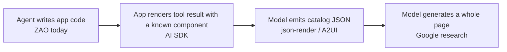

# Phase 1 study · Track B: Design systems for agents and generative UI

_Research findings for B1–B5 · 30 September 2026_

This is an agent-produced reference for [Track B](./STUDY.md), grounded in the linked sources and ZAO's current repo. It separates **documented capabilities**, **ZAO's current or planned state**, and **proposed experiments or positions**. The personal reflection prompts in the study plan remain Yankun's to write. No comparison screen or mini eval has been run for this document, so it reports no observed before-and-after results.

## B1 · Why agents make generic UI

[Anthropic's frontend-design Skills article](https://claude.com/blog/improving-frontend-design-through-skills) describes a distributional problem: without specific context, generated interfaces tend toward common training-set choices, such as familiar fonts, purple-on-white treatments, predictable composition, weak hierarchy, and little purposeful motion. A skill can inject more specific design direction at the moment of work. [Brad Frost](https://bradfrost.com/blog/post/agentic-design-systems-in-2026/) argues for grounding agent output in real system materials rather than unbounded “vibe coding.” These are their arguments and demonstrations, **not measurements of ZAO**. Frost's linked video was not reviewed.

The table names risks to inspect in a future B1 screen. It is not a list of mistakes observed in an agent-generated ZAO comparison.

| Risk to look for                                | ZAO response today                                                                                                                                                         | What is still missing                                                                                                                                                                                                                          |
| ----------------------------------------------- | -------------------------------------------------------------------------------------------------------------------------------------------------------------------------- | ---------------------------------------------------------------------------------------------------------------------------------------------------------------------------------------------------------------------------------------------- |
| Default-feeling typography                      | Self-hosted faces and `type-*` roles in [`theme.css`](../packages/react/src/styles/theme.css); [`AGENTS.md`](../AGENTS.md) limits the display face to display/title roles. | The docs have a finish sample, but no component or page-pattern guidance that explains hierarchy in realistic flows.                                                                                                                           |
| Unrelated colors or decorative gradients        | Named Tailwind color defaults are removed; semantic colors and finish/mode tokens give a small vocabulary.                                                                 | Raw CSS and arbitrary classes can still bypass guidance; the [validator](../packages/agent/README.md) is planned.                                                                                                                              |
| Inconsistent spacing, shape, or control height  | `AGENTS.md` names fen steps, role-based radii, and three control heights.                                                                                                  | The allowed spacing subset is **guidance**, not an enforced CSS limit: `--spacing` allows `p-7`, and Tailwind supports arbitrary values. No ZAO lint/validator exists yet. [Tailwind padding reference](https://tailwindcss.com/docs/padding). |
| Repetitive cards and shallow hierarchy          | Type roles and semantic surfaces supply primitives.                                                                                                                        | Page patterns, component composition guidance, and actual components are still absent.                                                                                                                                                         |
| Glass on every surface                          | `material-overlay` and the floating-layer rule state where glass belongs.                                                                                                  | Raw `backdrop-filter` is not automatically caught.                                                                                                                                                                                             |
| Motion without a purpose or reduced-motion path | Motion tokens and reduced-motion treatment exist in the theme.                                                                                                             | Component-specific transition/state guidance and interaction tests remain future work.                                                                                                                                                         |
| Generic action or error copy                    | `AGENTS.md` asks for sentence case, specific action/result verbs, and actionable errors.                                                                                   | No copy validator or component content examples yet.                                                                                                                                                                                           |
| Missing states, focus, or keyboard behavior     | Focus utilities and token contrast tests are present.                                                                                                                      | Base UI components, Storybook stories, keyboard tests, and axe coverage have not shipped.                                                                                                                                                      |

The useful lesson is to make the likely correct action easy to discover and check. Constraints that are merely written down still need examples and validation; otherwise an agent may bypass them while producing code that builds. ZAO should also surface genuine gaps for a person to decide, rather than forcing every new situation through an existing token or component. Anthropic's example style choices are not ZAO palette or font recommendations: the [brief](../BRIEF.md) reserves visual values for Yankun. [Figma's design-systems/MCP argument](https://www.figma.com/blog/design-systems-ai-mcp/) similarly centers design context and intended use, though it is a product argument rather than a ZAO eval result.

## B2 · Giving agents design context

The [MCP introduction](https://modelcontextprotocol.io/docs/getting-started/intro) and [architecture](https://modelcontextprotocol.io/docs/2026-07-28/learn/architecture) describe a host application connecting through clients to servers. A server can expose **resources** for context, **tools** for actions, and **prompts** for reusable workflows. MCP handles discovery and exchange; it does not guarantee that an agent chooses the right component or follows a rule. Local servers commonly use stdio, while remote servers use Streamable HTTP. For ZAO, token/component data could be resources, component search and validation could be tools, and a component-selection workflow could be a prompt. Those are proposals; [`packages/agent`](../packages/agent/README.md) contains a plan, not an MCP implementation.

| Context channel                                                                                                                                                                             | What the linked source supplies                                                                                                                                                                      | Implication for ZAO                                                                                                                                                         |
| ------------------------------------------------------------------------------------------------------------------------------------------------------------------------------------------- | ---------------------------------------------------------------------------------------------------------------------------------------------------------------------------------------------------- | --------------------------------------------------------------------------------------------------------------------------------------------------------------------------- |
| [Figma MCP](https://help.figma.com/hc/en-us/articles/32132100833559-Guide-to-the-Figma-MCP-server) and [Code Connect](https://help.figma.com/hc/en-us/articles/23920389749655-Code-Connect) | Design nodes, variables, component context, and a mapping from a design component to its actual code representation.                                                                                 | Useful once ZAO has a Figma library and code mappings; a frame alone is not the component API.                                                                              |
| [Storybook MCP](https://storybook.js.org/docs/ai/mcp/overview)                                                                                                                              | In preview: an opt-in component manifest for supported frameworks, stories, and props/docs. Test and accessibility tools need separate setup; it tells agents to inspect props instead of guessing.  | The [brief](../BRIEF.md) plans Storybook as a baseline, but there are no ZAO stories or Storybook config yet. Add intent and use/avoid guidance on top of API facts.        |
| [shadcn MCP](https://ui.shadcn.com/docs/mcp)                                                                                                                                                | Searches and installs items from [component registries](https://ui.shadcn.com/docs/registry/mcp).                                                                                                    | Relevant if ZAO later ships its proposed registry; no registry is available in this repo today.                                                                             |
| Repo `AGENTS.md`                                                                                                                                                                            | Static local rules at coding time. OpenAI's [`apps-sdk-ui` guide](https://github.com/openai/apps-sdk-ui/blob/main/AGENTS.md) includes component inventory, file/story conventions, and exact checks. | ZAO's [`AGENTS.md`](../AGENTS.md) has stronger token, finish, and copy rules; its component inventory, API/stories, and self-check workflow still need the component layer. |

An agent needs the following context **at the decision point**, with a clear indication of what is current and what is planned:

1. The task's user goal, target surface, finish/mode, and any host-product constraints.
2. A component catalog with intent, use/avoid rules, allowed compositions, default choice, and verified props.
3. Semantic tokens and type/space/material roles, including why raw values or off-scale choices are disallowed.
4. Real examples for states, responsive behavior, keyboard interaction, focus, and reduced motion.
5. Design-to-code mappings if the source is Figma; otherwise code and stories remain the authority for implementation.
6. Package or registry version and an install/import path that matches the docs.
7. Preview and validation steps, including what tests guarantee and what needs human review.

Static files can provide policy; MCP can retrieve current facts and run checks. Storybook's opt-in manifest makes supported component metadata and docs queryable; ZAO's planned custom manifest would add intent, use/avoid rules, and allowed compositions. Code Connect joins a design node to an implementation. No B2 scratch MCP setup or same-screen comparison was run, so this checklist is based on the sources and ZAO repo rather than observed output.

## B3 · Generative UI landscape

There are two different questions: **which part of the UI does the model specify, and when?** and **how is the result carried or hosted?** Treating them as one continuum makes AG-UI, A2UI, and MCP Apps sound interchangeable when they solve different problems.

_This follows the four examples in the study plan. It is not a ranking of freedom, maturity, or quality: build-time code generation can be less constrained than a fixed runtime component._

| Production pattern                          | What happens                                                                                                                                                                                                                                                                                                                                                 | ZAO relationship                                                                                                                            |
| ------------------------------------------- | ------------------------------------------------------------------------------------------------------------------------------------------------------------------------------------------------------------------------------------------------------------------------------------------------------------------------------------------------------------ | ------------------------------------------------------------------------------------------------------------------------------------------- |
| Write application code using a system       | An agent creates repository code while tokens, components, guidance, and checks constrain it. This is the current ZAO workflow target in [`BRIEF.md`](../BRIEF.md).                                                                                                                                                                                          | **First fit.** Tokens, theme, and `AGENTS.md` already exist; components, manifests, and validator are planned.                              |
| Render a known component from a tool result | The [Vercel AI SDK pattern](https://ai-sdk.dev/docs/ai-sdk-ui/generative-user-interfaces) renders an application-owned component from a model tool call and its returned data.                                                                                                                                                                               | Once components exist, a ZAO app could render them for known tool results. The model need not author JSX at runtime for this pattern.       |
| Compose a catalog-constrained UI tree       | [json-render](https://github.com/vercel-labs/json-render) constrains the model to a catalog and JSON spec; [A2UI](https://a2ui.org/introduction/what-is-a2ui/) describes declarative component/data updates rendered through a client catalog, including native clients. They are separate projects.                                                         | A ZAO catalog adapter is possible **after** components and manifests ship; neither protocol is currently implemented by ZAO.                |
| Generate the full interface                 | [Google Research's Generative UI](https://research.google/blog/generative-ui-a-rich-custom-visual-interactive-user-experience-for-any-prompt/) explores model-generated HTML/CSS/JS and assets for a prompt; its [paper/project](https://generativeui.github.io/) and [PAGEN dataset](https://generativeui.github.io/static/pagen/index.html) study quality. | This grants far more model freedom than ZAO's present constraint-first thesis; it is research evidence, not ZAO's v0.1 implementation plan. |

The delivery and hosting layer cuts across that map:

| Layer                                                                       | Job                                                                                                                                                                                                         | Boundary to remember                                                                                                                                              |
| --------------------------------------------------------------------------- | ----------------------------------------------------------------------------------------------------------------------------------------------------------------------------------------------------------- | ----------------------------------------------------------------------------------------------------------------------------------------------------------------- |
| [AG-UI](https://docs.ag-ui.com/introduction)                                | Event-based connection between an agent/backend and a frontend for messages, tool events, and state; it can carry UI updates.                                                                               | An event protocol does not itself define a component catalog. [CopilotKit's comparison](https://www.copilotkit.ai/ag-ui-and-a2ui) explains how it can carry A2UI. |
| [A2UI](https://a2ui.org/introduction/what-is-a2ui/)                         | Declarative UI representation and updates, interpreted by a client renderer and catalog.                                                                                                                    | It can travel over AG-UI or other transports; it is not the host container.                                                                                       |
| [MCP Apps](https://blog.modelcontextprotocol.io/posts/2026-01-26-mcp-apps/) | An MCP tool can point to a `ui://` resource that the client renders as interactive web UI in a sandboxed chat iframe. See the [current overview](https://modelcontextprotocol.io/extensions/apps/overview). | This hosts web UI inside an AI client; it does not prescribe ZAO components or A2UI rendering.                                                                    |
| OpenAI Apps SDK                                                             | A ChatGPT-specific way to build hosted app UI, with [host UI guidelines](https://developers.openai.com/plugins/concepts/ui-guidelines).                                                                     | Its fonts, color rules, and layout expectations apply to that host; they are not universal MCP Apps styling rules.                                                |

**Where ZAO should serve first:** repository code generation. That is already the brief's product and eval target, and the repo has real tokens and a constrained theme to supply. The next meaningful expansion is a component manifest and validator, because a protocol endpoint without accurate component intent would only make incomplete context easier to retrieve. A catalog adapter for A2UI or json-render becomes plausible after the seven planned components exist. This is a recommended sequence, not a decision made for Yankun.

**Whose design system wins inside another product?** The host controls its surrounding interface and sets the integration contract. A2UI explicitly lets a client map catalog entries to its [own design system](https://a2ui.org/guides/defining-your-own-catalog/) and [theme](https://a2ui.org/guides/theming/). For ChatGPT-hosted UI, the current [OpenAI UI guidelines](https://developers.openai.com/plugins/concepts/ui-guidelines) call for host system colors and fonts; the URL in `STUDY.md` redirects there. An MCP Apps iframe does not automatically inherit the host's CSS, so a ZAO-backed widget would need to apply those host rules intentionally. Thus ZAO can supply semantics and behavior inside a hosted widget, while full Su/Yu styling belongs on ZAO-owned surfaces or hosts that permit it. This conclusion is an inference from those host-specific sources, not a universal MCP rule.

## B4 · A mini eval

The [brief's eval design](../BRIEF.md) calls for the same realistic task under three conditions: a generic stack, the package alone, and the package plus agent guidance. Its planned measures include token/material violations, accessibility, component reuse, and a blind review of hierarchy, restraint, copy, and states. The [eval directory](../evals/README.md) is still a plan, and [ZAO components](../packages/react/src/index.ts) have not shipped. A plain-versus-current-ZAO study now could examine today's token theme and `AGENTS.md`, but it could not yet support a component-reuse claim or stand in for the brief's full three-condition eval.

### Reproducible one-screen study

Use a blank Next.js/Tailwind project for **P** (plain) and a clean ZAO checkout with [`AGENTS.md`](../AGENTS.md) for **Z** (current ZAO). Give both fresh sessions of the same model and the exact prompt below. Keep the model version, time and tool limits, viewport, browser, and opportunity to revise identical. Record the starting commit/dependencies, all prompts, and outputs. Do not coach either run after the prompt. Show the resulting screens to reviewers without condition labels. This pair changes the project, its dependencies, and its guidance together, so it is exploratory rather than a clean estimate of the effect of `AGENTS.md` alone. The later A/B/C design can separate those factors. [Agent-eval guidance](https://www.anthropic.com/engineering/demystifying-evals-for-ai-agents) recommends explicit tasks, trials, and outcome grading.

> Build a notification-settings screen for a workspace. People can choose email and in-app notifications for mentions and a weekly digest, set quiet hours with a start and end time, and save their changes. Show current values, a changed-but-unsaved state, saving feedback, a successful save, and an error with a way to retry. Use realistic copy and the existing project stack. Make the form usable with a keyboard and at a narrow viewport.

Capture the same viewport in the default state and in each state the screen supports. Inspect the DOM and keyboard path in addition to screenshots; visual appearance alone cannot establish accessibility. [Playwright's accessibility guidance](https://playwright.dev/docs/accessibility-testing) also distinguishes automated scans from manual review. Pin the browser, operating system, fonts, color scheme, and viewport because [screenshot rendering varies across environments](https://playwright.dev/docs/test-snapshots). For the ZAO run, inspect Su light, Su dark, and Yu dark. Apply the shared blind quality score in one comparable default context; report cross-finish portability separately, since P cannot literally render ZAO finishes. The later A/B/C eval should give the generic condition an equivalent light/dark requirement or score ZAO theme portability only for B/C. ZAO's current palettes are still achromatic placeholders, so visual-style preference is not a valid outcome measure at this stage.

| Dimension     | 0 — missing                                                                   | 1 — partial                                                    | 2 — clear evidence                                                                                          |
| ------------- | ----------------------------------------------------------------------------- | -------------------------------------------------------------- | ----------------------------------------------------------------------------------------------------------- |
| Hierarchy     | Main task and groups are hard to find.                                        | Main task is visible but sections or actions compete.          | Groups, controls, and primary action have a clear reading order.                                            |
| Restraint     | Inconsistent color, spacing, or decoration obscures the task.                 | Mostly controlled, with avoidable extras or inconsistency.     | Each visual choice supports a role and stays consistent.                                                    |
| Copy          | Generic labels or unclear errors.                                             | Mostly understandable, but action/result or recovery is vague. | Labels state actions; errors explain what happened and how to recover.                                      |
| States        | Important saving, success, error, or dirty states absent.                     | States exist but are ambiguous or incomplete.                  | Required states are distinct, understandable, and connected to actions.                                     |
| Accessibility | Missing labels, unusable keyboard path, invisible focus, or contrast failure. | Core path works with notable gaps.                             | Labeled controls, a working keyboard path, visible focus, and contrast that meets the applicable threshold. |

Use two independent reviewers if possible, record short evidence for every score, and keep automated checks separate from the human score. Count ZAO token/material violations only for Z; judge P on observable inconsistency and legibility without treating valid generic-project raw values as ZAO violations. A single pair is diagnostic, not proof of a general effect.

**Result status:** unrun. No screenshots, scores, differences, or newly discovered ZAO rules are claimed here. Three candidates for the later real eval are: (1) run all three brief conditions on matched scaffolds, reporting A-to-B package effects and B-to-C guidance effects; (2) use multiple tasks, runs, and blind reviewers, retaining failures; and (3) check every shipped finish and mode with automated token, contrast, keyboard, and axe rules alongside human judgment. These are proposals, not measured findings.

## B5 · Candidate position: what a design system for agents is

_Agent-authored draft for Yankun to evaluate; it is not a statement in his voice or an adopted edit to [`BRIEF.md`](../BRIEF.md)._

A design system for agents is a set of decisions the agent can discover, apply, and check while building an interface. It needs more than token values or a component catalog. The agent must know each part's job, the conditions for choosing it, the allowed ways to combine it, and how to tell whether the result upheld the system's promises. The same information should help a person reviewing the work.

ZAO's first job is to make the common choice obvious. Its semantic tokens, role-based type, and small spacing scale reduce accidental variation now; planned constrained component APIs would extend that approach. Rules such as “glass belongs on floating layers” need an explanation and a check, because an agent can follow a literal rule in the wrong situation. Component manifests and examples can carry intent and edge cases; tools such as MCP can make those facts available at the moment the agent works. The protocol is a way to deliver context, not the design system itself.

The system also needs to reveal when it is insufficient. A new interaction, a missing state, or a visual direction that ZAO has not chosen should be reported as a gap, not patched with an arbitrary value. The structure can be shared while Su and Yu express different finishes, but those finishes and their visual values remain Yankun's decisions. An agent can generate options and explain trade-offs; it should not silently decide the style.

Finally, ZAO should demonstrate an effect. Compare matched prompts with and without the package and guidance, inspect accessible behavior and all shipped finishes, and have people judge hierarchy, copy, restraint, and state coverage without knowing the condition. If the results do not improve, the rules or delivery mechanism need revision. This makes “agent-friendly” an observed property of the system rather than a label.

The current [brief's thesis](../BRIEF.md) already has the same core: shrink the choice space, explain the system in machine-readable form, and prove its effect. This research does not justify changing the thesis yet. Until an eval exists, “plans to test its effect” would be more precise as a status claim than “proves its effect”; that is a proposed wording change, not an edit to the brief. The strongest additions to test are **gap reporting** and **whether the agent receives decision guidance when it needs it**.

## Study actions covered and remaining

| Unit | Covered in this research                                                        | Not yet observed or personal work                                                |
| ---- | ------------------------------------------------------------------------------- | -------------------------------------------------------------------------------- |
| B1   | Source-grounded explanation and a ZAO rule/gap map.                             | Generate a blank-project screen and name the actual slop choices it made.        |
| B2   | MCP model, system comparison, and an agent-context checklist.                   | Set up an MCP server in a scratch project and compare the same prompt with B1.   |
| B3   | Map of UI-generation approaches, delivery layers, and ZAO's proposed first fit. | Redraw the map and state the host-system trade-off in Yankun's own words.        |
| B4   | Fixed prompt, control plan, scorecard, and real-eval improvements.              | Run the paired agents, take screenshots, score evidence, and list observed gaps. |
| B5   | One-page candidate position and a proposed thesis wording refinement.           | Write the final position in Yankun's voice and choose any brief update.          |
