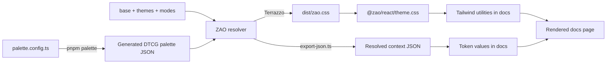

# Phase 1 study · Track C: The stack in the ZAO repo

_Research findings for C1–C7 · 30 September 2026_

This is an agent-produced reference for [Track C](./STUDY.md). It traces the current repo against the linked documentation and marks planned tools separately. The hands-on exercises in `STUDY.md` are for Yankun to perform; this document does not claim that he changed tokens, used VoiceOver, wrote a test, or opened a pull request.

## C1 · How the repo fits together

[pnpm workspaces](https://pnpm.io/10.x/workspaces) make the packages and apps in [`pnpm-workspace.yaml`](../pnpm-workspace.yaml) one project. `@zao/react` depends on `@zao/tokens` through `workspace:*`, and `@zao/docs` depends on both. The workspace build runs package scripts in dependency order; pnpm's [recursive command](https://pnpm.io/10.x/cli/recursive) and [filtering](https://pnpm.io/10.x/filtering) explain the root script syntax.

| Place                                                           | Job today                                                                                                        |
| --------------------------------------------------------------- | ---------------------------------------------------------------------------------------------------------------- |
| [`packages/tokens`](../packages/tokens/)                        | DTCG source, palette generator, resolver, Terrazzo build, resolved JSON, tests. Its `dist/` output is generated. |
| [`packages/react`](../packages/react/)                          | Self-hosted fonts and the Tailwind v4 theme. It does not yet export the planned component set.                   |
| [`apps/docs`](../apps/docs/)                                    | Next.js site and token-driven foundation pages.                                                                  |
| [`packages/agent`](../packages/agent/) and [`evals`](../evals/) | Planned agent layer and evaluation work, not active workspace packages today.                                    |
| [`study`](./)                                                   | The Phase 1 plan, findings, and visual references.                                                               |

The root [`package.json`](../package.json) defines `pnpm dev` as **`pnpm build` followed by `pnpm --filter @zao/docs dev`**. `pnpm build` runs the package builds: tokens call `tz build` and export resolved JSON; React copies/builds fonts and compiles TypeScript. Next then starts the docs development server. `pnpm dev` does **not** regenerate palettes, and the token build happens only once at startup. After changing token source, rerun the relevant build or restart `pnpm dev` until the live-rebuild work in [`PLAN.md`](../PLAN.md) lands. `pnpm install` and a fresh `pnpm dev` were not run for this study; an already-running local docs server responded with HTTP 200.

For one visible path, [`light.tokens.json`](../packages/tokens/src/modes/light.tokens.json) aliases `color.bg.canvas` to `palette.neutral.light.2`. The generated CSS sets `--zao-color-bg-canvas` through that palette step. [`theme.css`](../packages/react/src/styles/theme.css) maps it to Tailwind's `bg-canvas` utility, used by the `<body>` in [`app/layout.tsx`](../apps/docs/app/layout.tsx). The docs' token tables read the separately exported context JSON through [`lib/tokens.ts`](../apps/docs/lib/tokens.ts), so the displayed values follow the same source. The compiled CSS was inspected; the browser DevTools variable-edit exercise remains open.

## C2 · The CSS a design system relies on

[CSS custom properties](https://developer.mozilla.org/en-US/docs/Web/CSS/Guides/Cascading_variables/Using_custom_properties) declared with `--` participate in the cascade and normally inherit. `var()` reads the value in the element's current scope. ZAO emits variables under `[data-zao-theme]` and `[data-zao-mode]`, so an inner themed element can override inherited colors while retaining the same semantic utility names. [`terrazzo.config.ts`](../packages/tokens/terrazzo.config.ts) emits Su light, Su dark, and Yu dark. A Yu element without an explicit mode uses Yu dark; Yu light is not shipped yet.

[Tailwind's theme variables](https://tailwindcss.com/docs/theme) connect CSS variables to utility namespaces. ZAO's [`theme.css`](../packages/react/src/styles/theme.css) clears selected Tailwind defaults, maps semantic tokens with `@theme inline`, and defines compound type utilities such as `type-body`. With `@theme inline`, a utility like `bg-canvas` uses `var(--zao-color-bg-canvas)` directly, allowing a nested finish island to resolve its own value. The policy in [`AGENTS.md`](../AGENTS.md) limits spacing to named fen steps, though the current `--spacing` multiplier can still compile an off-scale class such as `p-7`; a future lint rule would have to enforce that part of the policy.

[OKLCH](https://evilmartians.com/chronicles/oklch-in-css-why-quit-rgb-hsl) separates perceived lightness (`L`), chroma (`C`), and hue (`H`), making systematic light and dark ramp generation easier than shifting RGB or HSL channels. It does not remove gamut limits: ZAO's generator maps requested colors into sRGB before writing the generated token files. In the current [`palette.config.ts`](../packages/tokens/palette.config.ts), Su and Yu neutral and accent chroma are zero placeholders; their final visual direction has not been chosen.

**Reproducible C2 check:** In docs DevTools, inspect `bg-canvas` on `<body>`, change `--zao-palette-neutral-light-2` in a Su-light scope, then add `data-zao-theme="yu"` to an inner element. Observe the computed color and which variables change. This live mutation was not performed for this document.

## C3 · React and TypeScript in the docs

[Thinking in React](https://react.dev/learn/thinking-in-react) starts from a component tree and a minimal source of state. [Adding Interactivity](https://react.dev/learn/adding-interactivity) connects event handlers to state changes; [effects](https://react.dev/learn/synchronizing-with-effects) synchronize with external systems rather than derive display values that can be computed during render. TypeScript's [Everyday Types](https://www.typescriptlang.org/docs/handbook/2/everyday-types.html) covers unions and optional properties; its [Generics](https://www.typescriptlang.org/docs/handbook/2/generics.html) chapter explains reusable type parameters.

| Repo example                                                    | What to read from it                                                                                                                                                                                                                                                                                                 |
| --------------------------------------------------------------- | -------------------------------------------------------------------------------------------------------------------------------------------------------------------------------------------------------------------------------------------------------------------------------------------------------------------- |
| [`FinishSample`](../apps/docs/components/finish-sample.tsx)     | Required `theme`, `mode`, and `label` props; union types for the two finishes and modes; `CSSProperties` for a token-derived gradient. It renders the same sample markup in different themed islands. Its demonstration buttons have no click handlers.                                                              |
| [`FinishSwitcher`](../apps/docs/components/finish-switcher.tsx) | A client component that passes values and change callbacks to `Segment<T extends string>`. `disabled?: boolean` is an optional prop; the generic keeps each segment's options, value, and callback aligned.                                                                                                          |
| [`useFinish`](../apps/docs/components/use-finish.ts)            | Reads root data attributes, local storage, and the OS color preference through [`useSyncExternalStore`](https://react.dev/reference/react/useSyncExternalStore). Its subscription removes the mutation observer and media listener. `useCallback` returns setters; this file does not use `useState` or `useEffect`. |

The distinction matters: the switcher's current finish is browser state shared outside one React component, so `useSyncExternalStore` is a more exact example than describing it as ordinary local `useState`. The C3 “change the sample, then revert it” exercise was not performed.

## C4 · Headless components and accessibility

[Base UI](https://base-ui.com/react/overview/quick-start) provides unstyled interaction primitives; its [styling guide](https://base-ui.com/react/handbook/styling) exposes classes, state attributes, and CSS variables. Its [accessibility guidance](https://base-ui.com/react/overview/accessibility) explains that using the primitive does not finish the accessibility work. For ZAO, Base UI can supply behavior and much of the keyboard, focus, and ARIA machinery. ZAO still needs token-bound appearance, visible focus, labels and copy, contrast, state coverage, and application-specific tests. Base UI is planned for the component set; the current `@zao/react` package does not yet contain those components.

| Pattern                                                                | Key behavior from the ARIA Authoring Practices Guide                                                        | ZAO implication                                                                                                                                                                    |
| ---------------------------------------------------------------------- | ----------------------------------------------------------------------------------------------------------- | ---------------------------------------------------------------------------------------------------------------------------------------------------------------------------------- |
| [Button](https://www.w3.org/WAI/ARIA/apg/patterns/button/)             | A focused button activates with Space or Enter.                                                             | Prefer the native button element and preserve a visible focus indication.                                                                                                          |
| [Modal dialog](https://www.w3.org/WAI/ARIA/apg/patterns/dialog-modal/) | Focus moves inside, Tab stays within the modal, Escape closes it, and focus usually returns to the opener.  | Verify initial focus, focus return, accessible name, and the actual modal boundary.                                                                                                |
| [Listbox](https://www.w3.org/WAI/ARIA/apg/patterns/listbox/)           | Arrow keys move focus; selection and focus can differ; Home/End and typeahead depend on the implementation. | Test the specific widget used. Base UI Select has a trigger and popup, so the [select-only combobox pattern](https://www.w3.org/WAI/ARIA/apg/patterns/combobox/) is also relevant. |

The [WCAG 2.2 text contrast criterion](https://www.w3.org/WAI/WCAG22/Understanding/contrast-minimum.html) requires at least **4.5:1 for normal text** and **3:1 for large text** at AA. The [non-text contrast criterion](https://www.w3.org/WAI/WCAG22/Understanding/non-text-contrast.html) requires **3:1** for visual information needed to identify components, states, and meaningful graphics against adjacent colors. ZAO's [`token tests`](../packages/tokens/test/tokens.test.ts) currently check stronger 7:1 default text; 4.5:1 muted, accent, status, and on-accent text; and 3:1 focus-ring color on canvas and surface in its three shipped contexts. The input-border non-text check is still marked `it.todo`, so the tests do not establish all component contrast.

An agent used only the keyboard on [Base UI's Select demo](https://base-ui.com/react/components/select): Space opened the popup, Down moved focus, Enter selected and closed it, and Escape closed a reopened popup without changing selection. This is a narrow browser observation, **not a VoiceOver result**. The study plan's VoiceOver comparison remains for Yankun.

One repo-specific review point: [`FinishSwitcher`](../apps/docs/components/finish-switcher.tsx) uses `role="radiogroup"` and `role="radio"` on click-driven buttons without arrow-key or roving-tabindex behavior. The [APG radio pattern](https://www.w3.org/WAI/ARIA/apg/patterns/radio/) expects arrow-key movement within a group. This is a code-level concern to verify and fix when working on the control; it is not a screen-reader test result.

## C5 · The token build

The current [Terrazzo docs](https://terrazzo.app/docs/) and [Resolvers & Theming guide](https://terrazzo.app/docs/guides/resolvers/) explain how token sets are combined into contexts. The older “Modes and theming” URL in `STUDY.md` now leads to a generic landing page, so use the resolver guide for this unit.

1. [`palette.config.ts`](../packages/tokens/palette.config.ts) supplies a hue, peak chroma, optional solid-step lightness, and a finish-wide contrast parameter for neutral, accent, and status ramps.
2. [`generate-palettes.ts`](../packages/tokens/scripts/generate-palettes.ts) uses fixed lightness anchors and per-step chroma shares to make 12 steps in light and dark. An optional `solid` value sets step 9 and moves step 10 by 0.04 for hover. `contrast` shifts text steps 11 and 12; it does not alter the whole ramp. Culori maps colors into sRGB, and the generator writes `src/palettes/*.generated.tokens.json`.
3. [`zao.resolver.json`](../packages/tokens/src/zao.resolver.json) resolves **shared structure → finish → mode**. This yields semantic token values for the selected context.
4. [`terrazzo.config.ts`](../packages/tokens/terrazzo.config.ts) builds CSS variables for the three shipped contexts. [`export-json.ts`](../packages/tokens/scripts/export-json.ts) exports their resolved JSON and index for consumers. `pnpm tokens` runs this token build; `pnpm palette` only regenerates palette source and must be followed by a build when output needs updating.

The C5 exercise deliberately changes `contrast`, runs `pnpm palette && pnpm test`, inspects the changed ramps, and restores the original input. It was **not** run here. In particular, there is no observed before-and-after ramp or test result to report from that exercise.

## C6 · Tests and CI

[Vitest](https://vitest.dev/guide/) runs the current [`tokens.test.ts`](../packages/tokens/test/tokens.test.ts). Its checks resolve each shipped context and compare semantic token IDs, enforce identical structural values across finishes, keep display/title sizes and line heights fixed while allowing their faces to vary, and test named contrast promises. A remaining `it.todo` records the input-border question. [Playwright](https://playwright.dev/docs/intro) is planned for interaction and visual checks, but no Playwright dependency, configuration, or suite is present in the current repo.

The [CI workflow](../.github/workflows/ci.yml) runs on pull requests and pushes to `main`: frozen-lockfile install, package build, token tests, docs build, typecheck, and formatting check. This describes the workflow file; no GitHub CI log was opened for this study. A useful test exercise would add a meaningful assertion on a scratch branch, observe it fail for the intended reason, make the minimal implementation change, and rerun the relevant checks. No such fail-then-pass exercise was performed here.

For this documentation update, `pnpm build && pnpm test && pnpm typecheck && pnpm format:check` passed locally. Vitest reported **48 passed and 1 existing TODO**; this run verifies the current suite, not the C6 test-writing exercise.

## C7 · Next.js and pull requests

The [Next.js App Router course](https://nextjs.org/learn/dashboard-app/creating-layouts-and-pages) maps folders and `page.tsx` files to routes while layouts wrap child pages. In ZAO, [`app/page.tsx`](../apps/docs/app/page.tsx) serves `/`; [`app/foundations/color/page.tsx`](../apps/docs/app/foundations/color/page.tsx) serves `/foundations/color`; typography and space follow the same folder pattern. [`app/layout.tsx`](../apps/docs/app/layout.tsx) applies the common HTML shell, theme initialization, header, navigation, and body styles.

Next's [server and client component guide](https://nextjs.org/docs/app/getting-started/server-and-client-components) explains the boundary: pages and layouts are server components by default; interactive children opt into `'use client'`. Here, the finish switcher and `useFinish` need browser APIs, while the layout and foundation page modules can stay server-rendered. The color page renders a client `ColorTokens` child to follow the selected context.

[`PLAN.md`](../PLAN.md) describes the current PR convention for Phase 2 work: a branch and signed commit, required builds/tests/typecheck/format, screenshots for lab changes, review, then merge by PR. Its proposed lab build applies once that lab exists; the current CI workflow builds only the packages and docs. Track C's temporary docs page and branch/commit/push/PR exercise was not performed, and no PR was reviewed for this document.

## What was covered and what remains hands-on

| Unit | Research completed                                                                                 | Study-plan exercise still open                                                             |
| ---- | -------------------------------------------------------------------------------------------------- | ------------------------------------------------------------------------------------------ |
| C1   | Workspace, package scripts, and token-to-docs path traced; existing docs server returned HTTP 200. | Run `pnpm install` and a fresh `pnpm dev`; follow the scripts while it starts.             |
| C2   | Cascade, OKLCH, Tailwind mapping, and generated CSS traced.                                        | Change a scoped custom property and finish attribute in DevTools; inspect computed styles. |
| C3   | Sample, switcher, and external-store hook read.                                                    | Make and revert one small sample change using ZAO utilities.                               |
| C4   | Base UI/APG/WCAG researched; Base UI Select demo checked with the keyboard.                        | Compare the demo with VoiceOver and record what it announces.                              |
| C5   | Generator, resolver, and output commands traced.                                                   | Temporarily change `contrast`, compare ramps and tests, then restore it.                   |
| C6   | Token tests and CI workflow read; Playwright status checked.                                       | Add a test on a branch, see it fail and pass, and read an actual GitHub CI log.            |
| C7   | Current routes, layout, client boundary, and PR convention traced.                                 | Add/remove a page locally and practice or review a real PR.                                |
